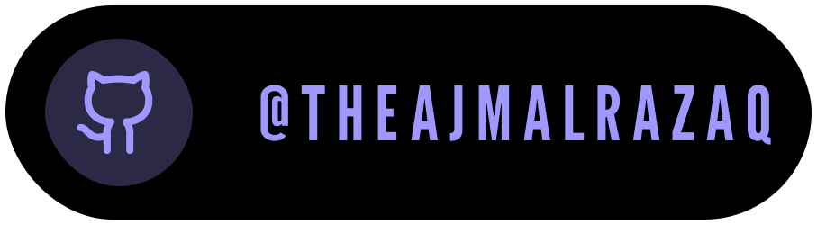

<h1 align="center">
	
 <a href="mailto:theajmalrazaq@gmail.com" target="blank">
	 <a href="https://www.linkedin.com/in/theajmalrazaq/">
	 <a href="https://github.com/theajmalrazaq">
	 <a href="https://x.com/theajmalrazaq">
</h1>

 

	

I'm Ajmal, A Junior Product Designer and Frontend Developer And.Here's a glimpse into my journey as a developer:

## Overview

As a passionate junior frontend developer, I specialize in crafting engaging and responsive web experiences. My expertise includes:
**HTML:** Crafting the foundation of web pages.

**CSS:** Styling to bring life and personality to websites.

**JavaScript:** Adding interactivity and dynamic features.

**SCSS:** Streamlining and enhancing the styling process.

### Beyond frontend technologies, I am proficient in:

**C++:** Navigating the intricacies of programming logic.

**Problem Solving:** Tackling challenges with analytical thinking.

## Academic Pursuits

Currently, I am enrolled in a Bachelor's program in Computer Science at FAST-NUCES. This academic journey complements my practical experience, providing a well-rounded understanding of the field.

 
<h3>Hacktoberfest 🏆 2023 Badges</h3>
	

